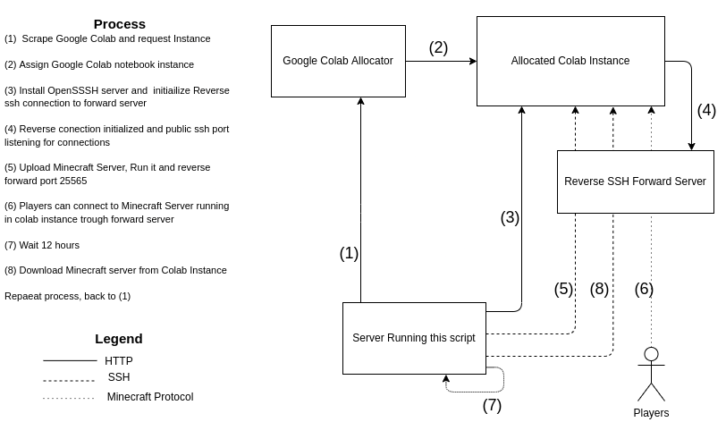

# colab-minecraft

Google Colab offers a ton of processing power for running Jupyter notebooks. Could this be used to run contrinuously a Minecraft Server and let players connect to it? Spoiler: Yes it can :sunglasses:

> ## March 2021-1 Update

> :broken_heart: Google implemented captcha to prevent automated access to Google Colab. This results in the minecraft server deploy lasting less tan an hour before they get shutdown because of a failed captcha. Well done Google. Deploying a server still works however. 


## What is this?
`colab-minecraft` is a set of javascript and bash scripts that allows you to **easily mount a minecraft server in a free Google Colab instance**. You will be able to connect just like any other server. 

Google Colab Free imposes a maximum runtime of 12 hours. To workaround this, there is included a script that will switch your running server to a new Colab Instance every certain amount of hours.


## Why?

Mostly Curiosity. It was a fun experiment and surprising to find that there are no major security barriers from Google. 

## Fair Warning

Using this script is not against Google TOC, however you are getting close to the limits probably. The usage of this software is under your own responsability. Don't abuse the great service Google Colab is, otherwise, some wise man once said  *"this is why we can't have nice things"*

## Requirements
* A computer running Unix-Like OS (linux, mac os). This will be used as a forwarding server, since you can't open ports on Colab instance.
* Ability to open ports. At least be able to open `22`, `8888`, `25565`. 
* OpenSSH server installed with `GatewayPorts` option enabled.

* Software:
    * Node >= 14
    * python3
    * netstat


## Solution
### Pseudocode
You can understand better what this script does with some pseudocode of the process
```
function deploy:
    Open a webserver and prepare endpoint with payload script
    Scrape google calab and press connect button
    Enter command on Colab to download payload script from webserver
    Wait until google collab executes script and crates ssh reverse connection to us
    Upload minecraft server to colab instance trough ssh tunnel
    Reverse forward port 25565 from colab instance to us
    Start minecraft server on instance
    Enjoy()

function switch:
    if time since last deploy < 11 hours: exit
    server = Download minecraft server from previous instance
    deploy(server)
    Enjoy()
```

### Process Diagram




Sidenote: To make it more clear, the "server running colab-minecraft" and "reverse SSH Forward server" are shown as separate, but you should run colab-minecraft in the same forwarding server.


## Source

Inside the `src` directory you will two dirs:
* `colab-robot`:  Node + Puppeteer implementation to automate the allocation of a new colab instance + SSH server Setup + Reverse SSh Connection
* `scripts`: Set of Bash Scripts to automate the whole process of deploying a new
minecraft server in google colab and renewing it before the 12 hour expiration.


## How to Run

Make sure to run this on a server meeting the requirements. Clone this repository and then:
1. Login to your google account and [create a Colab Notebook](https://colab.research.google.com/?hl=es#create=true).
2. Export your cookies using an extension [like this one](https://chrome.google.com/webstore/detail/%E3%82%AF%E3%83%83%E3%82%AD%E3%83%BCjson%E3%83%95%E3%82%A1%E3%82%A4%E3%83%AB%E5%87%BA%E5%8A%9B-for-puppet/nmckokihipjgplolmcmjakknndddifde). Colab-robot will use this
cookies to request Colab instances using your account. **Save the file in `cookies/cookies.json`**
3. Generate an ssh key with:     
    ```
    ssh-keygen -b 4096 -t rsa -f ssh-keys/colab_vps -q -N ""
    ```
    You can then connect to the allocated colab instance with this key.

4. Edit the example `servers/json/example-server.json` with your server info. Make sure to read the [Server JSON Format](servers/json/readme.md).

5. Edit the example `config/config.json` with your forwarding server. Make sure to read the [Config JSON Format](config/readme.md).


6. Create a `.tar.gz`  of your minecraft server. Make sure that it has the following structure: 
    - mc-server/
        - All your server files (world, properties, etc)
        - start.sh

    The `start.sh` file should be something like
    ```bash
    #!/bin/bash
    java -Xms8G -Xmx8G -jar server.jar nogui
    ```
    Notice the 8G heap? Thats Google blessing you with resources.
    
    **Save this file as `servers/tar/example-server.tar.gz`**

7. Run the script!
    * For deploying a new server, just run
    ```
    ./colab-minecraft.sh deploy example-server
    ``` 

    * For switching all your already running servers. Remember this a workaround for the 12 hour limit of colab
    ```
    ./colab-minecraft.sh switch
    ```

8. Connect to your server! :fire:
    * Minecraft: Using your minecraft client, connect to the `server_domain`  you used in the config file.
    * SSH: Run the command using the info you entered on `config/config.json`
    ``` bash
    ssh vps-user@server_domain -p server_ssh_port -i ./ssh_keys/colab_vps
    tmux a # Opening the server console
    ```
    Note: If you need root access, replace `vps-user` with  `root`
    Note: If you are accessing Minecraft or SSH from the forwarding server, replace `server_domain` by `localhost`


## Future Work

* If a minecraft server works, any software can. Generalize to deploy arbitrary software. 
* Try workarounds for the Captcha
* Automate the google account cookie recolection
* Use ssh key instead of user + pass to open reverse ssh tunnels from colab instance to forwarding server.